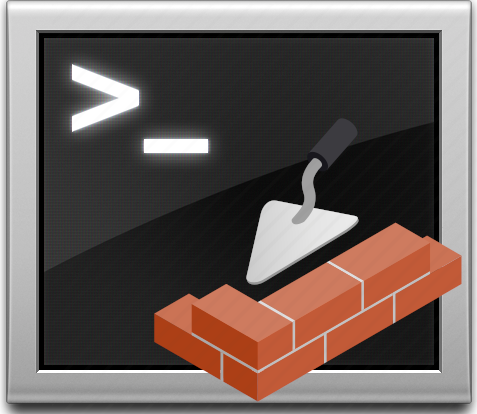

<!-- markdownlint-disable MD041 -->

<!-- markdownlint-enable MD041 -->

# Masonry

## What is Masonry

A complete development environment for Azure DataBricks workflows.

This solution includes a development container with all the required tooling to connect, test, and deploy python based DataBrick workflows.

## Getting started

- Download and unpack the [Release](https://github.com/ScruffyFurn/masonry/releases) that matches the DataBricks runtime of your cluster. (For example Masonry v0.0.*-10.4-LTS for Runtime 10.4 LTS)

    **NOTE:** 'LITE' versions use an exposed requirements.txt file to complete environment.

- To start follow [installing prerequisites documentation](./docs/install_prerequisites.md) to setup the local environnement.

- [Configure the Azure DataBricks cluster](./docs/configure_cluster.md) for connection.

- Gather the required information by [obtaining cluster information](./docs/obtaining_cluster_information.md).

- Next follow the [using the dev container](./docs/using_dev_contianer.md) documentation to start up the development environment.

## Using Masonry

See [building python library](./docs/building_python_library.md) for building python libraries.

See [running unit tests](./docs/running_unit_tests.md) for information on running unit tests.

See [run full code base linting locally](./docs/local_linting.md) for steps on running a full code base lint solution.

## Development Roadmap

See [Project Roadmap](https://github.com/users/ScruffyFurn/projects/5/views/4) for an up to date development roadmap.

## More information

See [masonry workflow](./docs/example_workflow.md) for a complete workflow overview with CI/CD example.

## Stay in touch

- Author - [Mickey "ScruffyFurn" MacDonald](https://scruffyfurn.com)

## License

[MIT License](LICENSE)

Copyright (c) 2022 Mickey MacDonald
