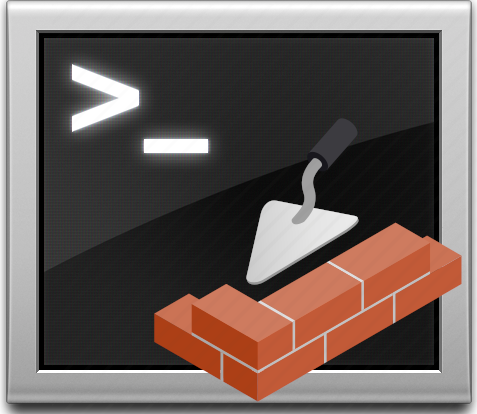

<!-- markdownlint-disable MD041 -->

<!-- markdownlint-enable MD041 -->
# Masonry CLI

## What is the Masonry CLI
The Masonry CLI is a toolchain that can be used to generate, build and test DataBricks Python libraries and notebooks.

## Table of Contents

- [What is the Masonry CLI](#what-is-the-masonry-cli)
- [Getting Started](#getting-started)
- [Useage](#usage)
- [Support](#support)
  - [Stay in touch](#stay-in-touch)
  - [licence](#license)

# Support

## Getting Started
## Usage

## Stay in touch

- Author - [Mickey "ScruffyFurn" MacDonald](https://scruffyfurn.com)

## License

[MIT License](LICENSE)

Copyright (c) 2022 Mickey MacDonald
