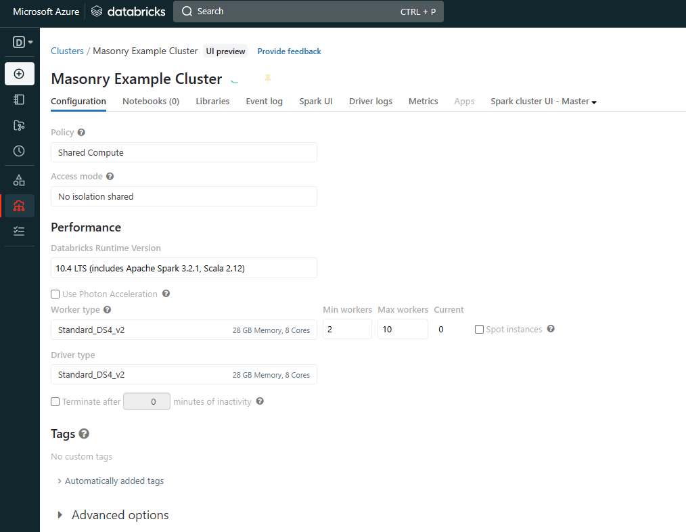
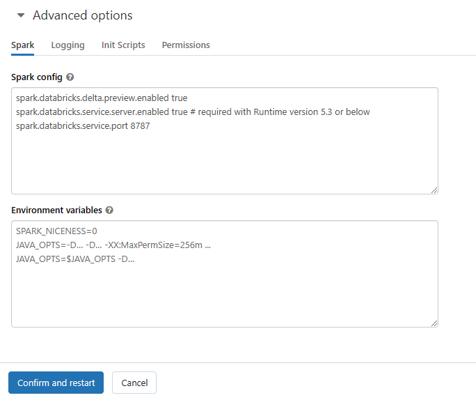

# Configure Azure DataBricks Cluster for connection

Visit your Databricks cluster page, and verify that your cluster supports python3.



Next open the 'Advanced Options' drop settings.



Add the following lines to the Spark Config:

```config
spark.databricks.service.server.enabled true # required with Runtime version 5.3 or below
spark.databricks.service.port 8787
```
