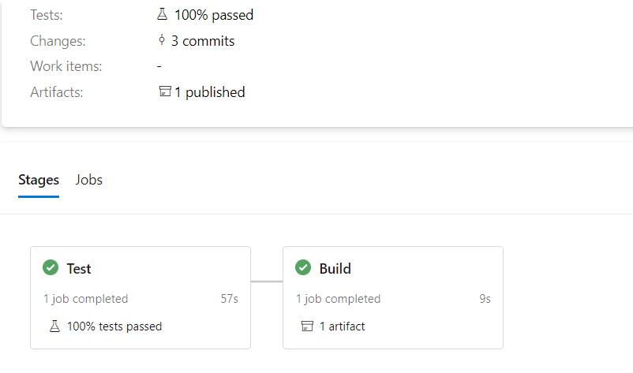
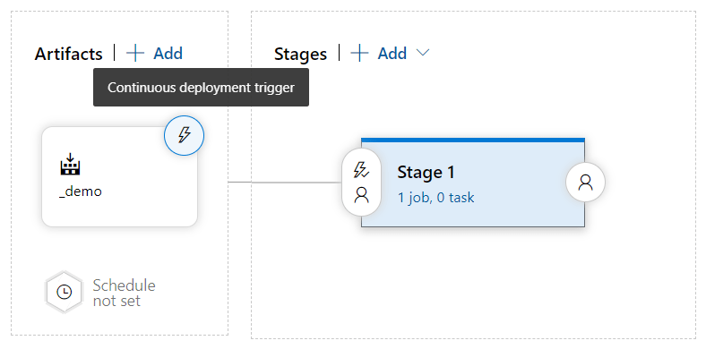
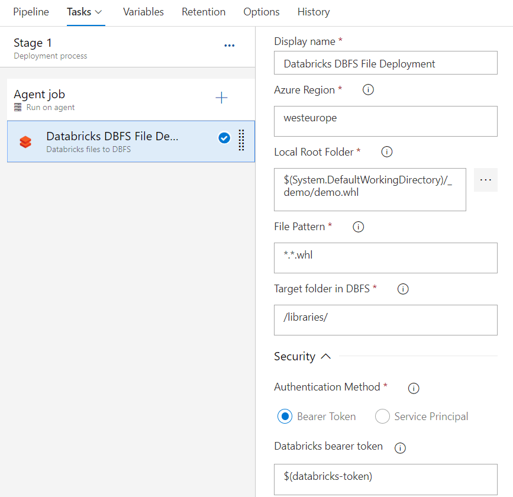
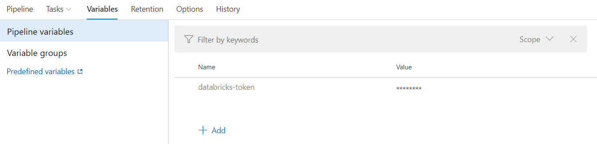
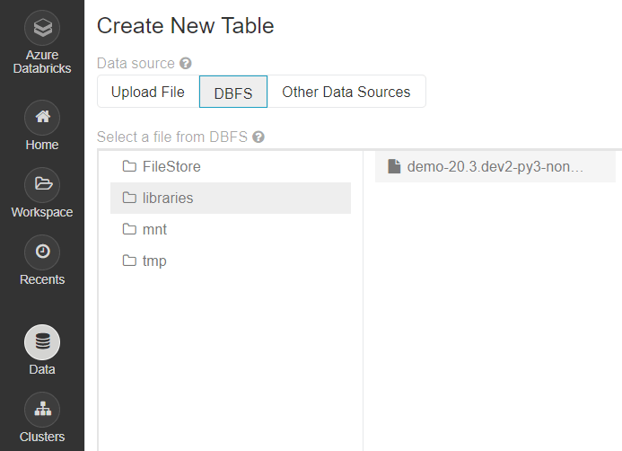

# CI/CD for python based DataBricks libraries

As part of a complete development work flow, we will applying ci-cd practices to continuously release our python libraries onto DataBricks deployments (continuous delivery / continuous deployment).

## Building the artifact

We’ll start with automating the process of testing and building the final packaged library using an Azure DevOps pipeline.

In the "./pipelines" directory, you find a file called __"build-python-library.yml"__. This file is the example Azure Devops pipeline used to build python library.

Note that we are using the same Conda environment used in the local development container, and are using databricks-connect to connect to the Azure DataBricks remote cluster to run the pytest unit tests.

build-python-library.yml:
```yaml
resources:
  - repo: self

trigger:
  - main
  - refs/tags/v*

variables:
  python.version: "3.8"
  major_minor: $[format('{0:yy}.{0:MM}', pipeline.startTime)]
  counter_unique_key: $[format('{0}.example_library', variables.major_minor)]
  patch: $[counter(variables.counter_unique_key, 0)]
  fallback_tag: $(major_minor).dev$(patch)

stages:
  - stage: Test
    jobs:
      - job: Test
        displayName: Test
        steps:
          - task: UsePythonVersion@0
            displayName: "Use Python $(python.version)"
            inputs:
              versionSpec: "$(python.version)"

          - script: conda env create --quiet --file environment.yml
            displayName: Create Anaconda environment
            workingDirectory: '$(System.DefaultWorkingDirectory)/Masonry/.devcontainer/databrick-env/'

          - script: |
              eval "$(conda shell.bash hook)"
              conda activate databrick-env
              echo "y
              $(WORKSPACE-REGION-URL)
              $(CSE-DEVELOP-PAT)
              $(EXISTING-CLUSTER-ID)
              $(WORKSPACE-ORG-ID)
              15001" | databricks-connect configure
            displayName: 'Configure DBConnect'

          - script: |
              eval "$(conda shell.bash hook)"
              conda activate databrick-env
              pip install typed_ast && make lint
            displayName: Lint
            workingDirectory: '$(System.DefaultWorkingDirectory)/Masonry/src/'

          - script: |
              eval "$(conda shell.bash hook)"
              conda activate databrick-env
              pip install pathlib2 && make test
            displayName: Test
            workingDirectory: '$(System.DefaultWorkingDirectory)/Masonry/src/'

          - task: PublishTestResults@2
            displayName: "Publish Test Results junit/*"
            condition: always()
            inputs:
              testResultsFiles: '$(System.DefaultWorkingDirectory)/Masonry/src/junit/*'
              testRunTitle: "Python $(python.version)"

  - stage: Build
    dependsOn: Test
    jobs:
      - job: Build
        displayName: Build
        steps:
          - task: UsePythonVersion@0
            displayName: "Use Python $(python.version)"
            inputs:
              versionSpec: "$(python.version)"

          - script: |
              eval "$(conda shell.bash hook)"
              conda activate databrick-env
              pip install wheel
            displayName: "Wheel"
            workingDirectory: '$(System.DefaultWorkingDirectory)/Masonry/src/'

          - script: |
              eval "$(conda shell.bash hook)"
              conda activate databrick-env
              # Get version from git tag (v1.0.0) -> (1.0.0)
              git_tag=`git describe --abbrev=0 --tags | cut -d'v' -f 2`
              echo "##vso[task.setvariable variable=git_tag]$git_tag"
            displayName: Set GIT_TAG variable if tag is pushed
            condition: contains(variables['Build.SourceBranch'], 'refs/tags/v')
            workingDirectory: '$(System.DefaultWorkingDirectory)/Masonry/src/'

          - script: |
              eval "$(conda shell.bash hook)"
              conda activate databrick-env
              # Get variables that are shared across jobs
              GIT_TAG=$(git_tag)
              FALLBACK_TAG=$(fallback_tag)
              echo GIT TAG: $GIT_TAG, FALLBACK_TAG: $FALLBACK_TAG

              # Export variable so python can access it
              export PACKAGE_VERSION=${GIT_TAG:-${FALLBACK_TAG:-default}}
              echo Version used in setup.py: $PACKAGE_VERSION

              # Use PACKAGE_VERSION in setup()
              python setup.py bdist_wheel
            displayName: Build
            workingDirectory: '$(System.DefaultWorkingDirectory)/Masonry/src/'

          - task: CopyFiles@2
            displayName: Copy dist files
            inputs:
              sourceFolder: $(System.DefaultWorkingDirectory)/Masonry/src/dist/
              contents: example_library*.whl
              targetFolder: $(Build.ArtifactStagingDirectory)
              flattenFolders: true

          - task: PublishBuildArtifacts@1
            displayName: PublishArtifact
            inputs:
              pathtoPublish: $(Build.ArtifactStagingDirectory)
              ArtifactName: example_library.whl


```

You may also notice that some of commands are called using a Makefile. The Makefile has defintions for various steps required for working with the python libraries. Below is the Makefile used in the example, and can be found in the __"src"__ directory of the Masonry solution.

MakeFile:
```MakeFile
help:
	@echo "Tasks in \033[1;32mdata_pipeline\033[0m:"
	@cat Makefile

lint:
	isort ./example_library
	black ./example_library
	mypy ./example_library --ignore-missing-imports
	flake8 ./example_library --ignore=$(shell cat .flakeignore)

dev:
	pip install -e .

test: dev
	pytest --ignore=sandbox --doctest-modules --junitxml=junit/test-results.xml
	bandit -r ./example_library/*.py -f xml -o junit/security.xml || true

build: clean
	pip install wheel
	python setup.py bdist_wheel

clean:
	@rm -rf .pytest_cache/ .mypy_cache/ junit/ build/ dist/
	@find . -not -path './.venv*' -path '*/__pycache__*' -delete
	@find . -not -path './.venv*' -path '*/*.egg-info*' -delete

```

### Creating an Azure DevOps pipeline

In Azure DevOps website portal create a new build pipeline. 

Select the Pipelines tab from the left and click the "New Pipeline" button.

Choose "Azure Repos Git" for "Where is your code" and then the repository to use.

On the Configure your pipeline screen, select the "Existing Azure Pipelines YAML File" and then select the build-python-library.yml file

Next, before we run our pipeline, we need to define some required variables.
Click the "Variables" button from the top right, and add the following variables with the appropriate values (these values are the same used when setting up the development container).

```bash
CSE-DEVELOP-PAT - dapi*
EXISTING-CLUSTER-ID - 0000-XXX
WORKSPACE-ORG-ID - 000X
WORKSPACE-REGION-URL - https://adb-*
```

Finally when variables have been set, click the “Run” button. If everything goes according to plan, an artifact will be created




## Uploading the library to DataBricks

To complete the CI/CD process, we can use an Azure DevOps release pipeline to upload the build artifact created in the Azure DevOps build pipeline described in the section above.

To get started, select the __"Pipelines/Releases"__ tab from the right in the Azure DevOps website portal.

Next, select the __"+New"__ button and then select the __"New release pipeline"__. Choose to start with an “Empty job”.

In the artifacts section, add your "example" build.

Click on the small bolt icon, and enable continuous-deployments. As a filter include the main branch.



In the first stage, add a new task by searching for “Databricks files to DBFS”, you may have to install this task from the marketplace. 

Fill in the required fields, using the following as reference:



Notice the use of the Bearer Token as the Authentication Method.

The last step before we run the release pipeline will be to get our previous created DataBricks token, and add it to a variable in the release pipeline:



Once the token variable has been added, trigger the release pipeline, and take a look inside the /libraries folder on DBFS, you should the newly added library package there


Whenever the package has successfully been built, this release is triggered, which will copy the artifact to DBFS, where Databricks notebooks will be able to pick it up and install it.
