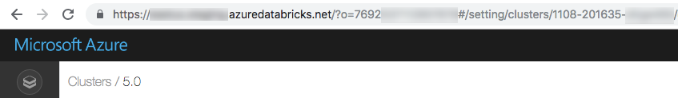

# Obtaining Cluster Information

Collect the following configuration properties:

- Azure Databricks [workspace URL](https://learn.microsoft.com/en-us/azure/databricks/workspace/workspace-details#workspace-url).

- Azure Databricks [personal access token](https://learn.microsoft.com/en-us/azure/databricks/dev-tools/auth#pat) or an [Azure Active Directory token](https://learn.microsoft.com/en-us/azure/databricks/dev-tools/auth#aadt).

  - For [Azure Data Lake Storage (ADLS) credential passthrough](https://learn.microsoft.com/en-us/azure/databricks/data-governance/credential-passthrough/adls-passthrough), you must use an Azure Active Directory token. Azure Active Directory credential passthrough is supported only on Standard clusters running Databricks Runtime 7.3 LTS and above, and is not compatible with service principal authentication.
  - For more information about authentication with Azure Active Directory tokens, see [Authentication using Azure Active Directory tokens](https://learn.microsoft.com/en-us/azure/databricks/dev-tools/databricks-connect#aad-tokens).

- The ID of the cluster you created. You can obtain the cluster ID from the URL. Here the cluster ID is 1108-201635-xxxxxxxx.

- The unique organization ID for your workspace. See [Get identifiers for workspace assets](https://learn.microsoft.com/en-us/azure/databricks/workspace/workspace-details).

- The port that Databricks Connect connects to. The default port is __15001__. If your cluster is configured to use a different port, such as __8787__ which was given in previous instructions for Azure Databricks, use the configured port number.
