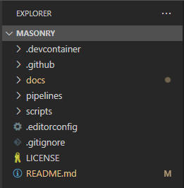
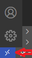

# Opening the development container

**NOTE:**

**To use the provided development container, you will need to open the
_./Masonry_ folder in VSCode to start.**

Start VSCode, run the Remote-Containers: Open Folder in Container... command
from the **Command Palette (F1)**

or click the quick actions **Status bar item** in lower left corner and select
Remote-Containers: Open Folder in Container

For more information, please see the [extension documentation.](https://aka.ms/vscode-remote/containers)
